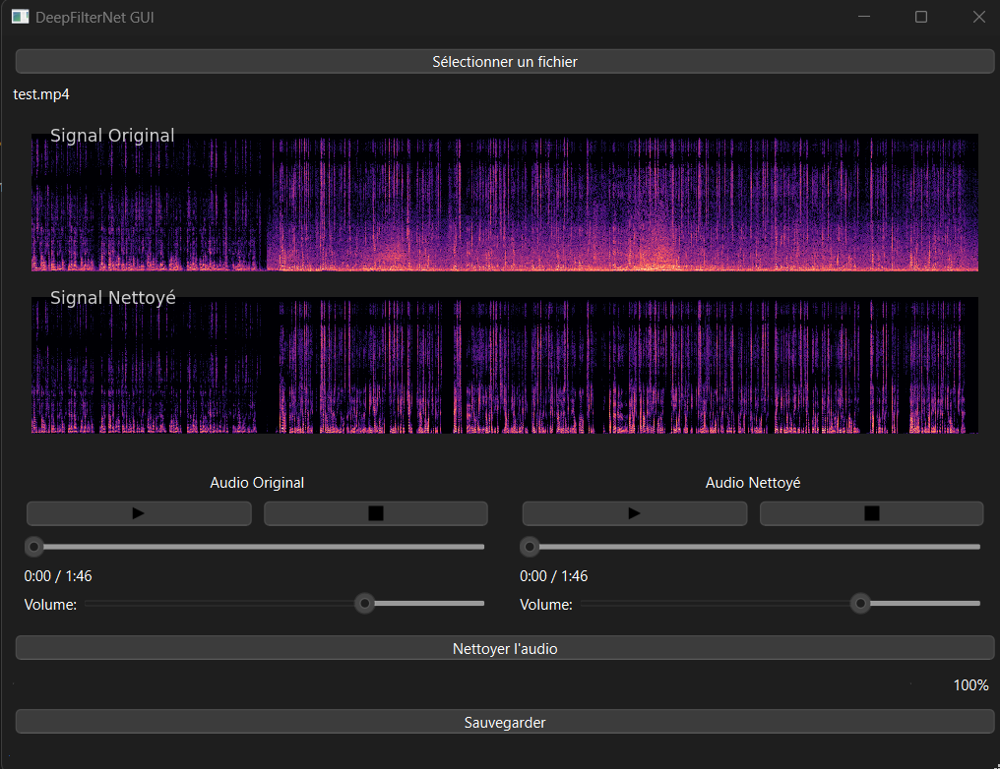

# Nettoyage Audio/Video avec DeepFilterNet

  DeepFilterNetGui

## Description

Cette application Python avec une interface graphique en PyQt6 permet de nettoyer les bruits parasites dans des fichiers audio ou vidéo en utilisant l'outil [**DeepFilterNet**](https://github.com/Rikorose/DeepFilterNet). 
Elle a pour but de simplifier l'utilisation de DeepFilterNet avec une interface graphique et des conversions automatiques des formats audio/vidéo. 
Les traitements sont rapides et se font localement.

## Usage
1. Lancer l'application :

    ```bash
    python main.py
    ```
    
- **Choisir un fichier audio/vidéo** : Importation facile de fichiers audio (wav, mp3, etc.) et vidéo (mp4, mkv, etc.).
- **Visualiser les spectrogrammes** : Visualisation en temps réel des spectrogrammes avant/après traitement.
- **Tester avec le lecteur audio** : Lecture avant/après nettoyage pour comparer les résultats.
- **Exporter** : Sauvegarde du fichier nettoyé dans son format d'origine ou dans un autre format.

## Capture d'écran



## Prérequis

- **Python 3.8+**
- **DeepFilterNet** (sous forme d'exécutable)
- **FFmpeg** (pour la gestion des formats vidéo)

## Installation

1. Clonez le dépôt :

    ```bash
    git clone https://github.com/dbwa/DeepFilterNetGui.git
    cd DeepFilterNetGui
    ```

2. Créez et activez un environnement virtuel Python :

    ```bash
    python -m venv env
    source env/bin/activate  # Sur Windows: env\Scripts\activate
    ```

3. Installez les dépendances :

    ```bash
    pip install -r requirements.txt
    ```

4. Installez FFmpeg :

    Suivez les instructions officielles pour installer FFmpeg : https://ffmpeg.org/download.html
    
    
5. Installer DeepFilterNet

    - Télécharger l'exécutable depuis https://github.com/Rikorose/DeepFilterNet/releases/ et le renommer en **deep-filter.exe** (Windows) ou **deep-filter** (Linux)
    - Assurez-vous que l'exécutable deep-filter est disponible dans votre `PATH` ou dans le répertoire du projet.


## Structure du projet

```bash
deepfilter_gui/
│
├── main.py                      # Interface graphique principale
├── deepfilter_interface.py      # Interface avec DeepFilterNet
├── utils.py                     # Fonctions utilitaires
├── requirements.txt             # Dépendances Python
└── assets/
    ├── icon.png                 # Icône de l'application
    └── screenshot.png           # Capture d'écran de l'application
```

## Contribuer
Les contributions sont les bienvenues ! Pour contribuer :
1. Fork le projet
2. Créez une nouvelle branche (`git checkout -b feature/NouvelleFonctionnalité`)
3. Commitez vos changements (`git commit -am 'Ajout d'une nouvelle fonctionnalité'`)
4. Poussez vos changements (`git push origin feature/NouvelleFonctionnalité`)
5. Ouvrez une Pull Request

## Licence
Ce projet est sous licence MIT. Consultez le fichier LICENSE pour plus d'informations.

## Crédits
DeepFilterNet : https://github.com/Rikorose/DeepFilterNet


17/11/2024
